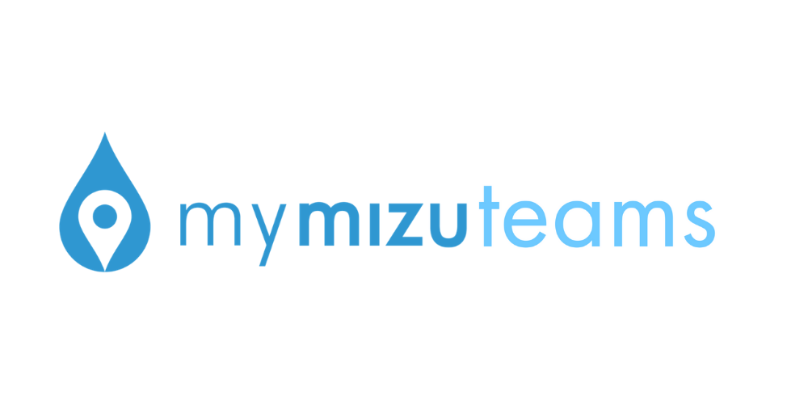

<h1>Introduction</h1>
MyMizu teams is a competitive app to gamify the Mymizu process and promote usage of the app.
<h1>User Guide</h1>
<h3>User Registration:</h3>
When using the app, you will need to create an account for tracking purposes. Your MyMizu user id is used to track refilling activities from the MyMizu databse.

<h3>DashBoard:</h3>
When logged in, if you do not belong to a team currently, you can create your team and add members to your team. The dashboard will display refill information for your Team.

<h3>Leaderboard:</h3>
You can click the leaderboard at the top to navigate to the leadboard page. You can choose Weekly and Monthly count, along with Total or average volume refilled to see which team performs the best.

<h1>Tech Stack</h1>
This App is server-less where firebase and firestore database services are used for deployment, account authorization and database storage respectively. React is used for the front-end rendering.

<h1>Contact</h1>
For questions and support please contact the developers:
<li href="https://github.com/dius00">Antonio</li>
<li href="https://github.com/kenny01123">Kenny</li>
<li href="https://github.com/heysivani">Sivani</li>
<li href="https://github.com/dhequex">Jose</li>